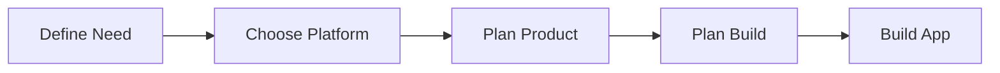

<!--
This source file is part of the Stanford Spezi open-source project.
SPDX-FileCopyrightText: 2026 Stanford University and the project authors (see CONTRIBUTORS.md)
SPDX-License-Identifier: MIT
-->

<p align="center">
  
</p>

<h1 align="center">SpeziVibe</h1>

<p align="center">
  <strong>Installable skills for building digital health software with AI coding tools.</strong>
</p>

<p align="center">
  <a href="https://github.com/StanfordSpezi/SpeziVibe/releases"></a>
  <a href="LICENSE.md"></a>
  <a href="https://github.com/StanfordSpezi/SpeziVibe/stargazers"></a>
</p>

---

Spezi Vibe packages reusable product, clinical, regulatory, interoperability, and platform guidance into skills that can be installed in minutes and used directly in real projects.

This work supports the broader [Spezi](https://github.com/StanfordSpezi) mission of lowering the barrier to building thoughtful, high-quality digital health experiences.

## Quick Start

Install all skills into your coding agent with a single command:

```bash
npx skills add StanfordSpezi/SpeziVibe --all
```

Or list them first to see what is available:

```bash
npx skills add StanfordSpezi/SpeziVibe --list
```

> **Need `npx`?** Install [Node.js](https://nodejs.org/) — `npm` and `npx` are included. Then confirm with `node -v && npx -v`.

### Manual Install

If you prefer not to use `npx`, download the latest `spezivibe-skills.zip` from [Releases](https://github.com/StanfordSpezi/SpeziVibe/releases), unzip it, and copy the skill folders into your coding tool's skills directory (e.g., `.claude/skills/` for Claude Code).

## New To Vibe Coding?

Vibe coding is a practical way of building software with an AI coding partner. Instead of starting from a blank page, you work in natural language: you describe the app, workflow, research plan, or technical constraint, and the agent helps you explore the codebase, make changes, draft plans, and explain tradeoffs.

If you are just getting started, these tools are a good place to begin:

- [Claude Code](https://docs.anthropic.com/en/docs/claude-code/getting-started) for terminal-based AI coding workflows
- [OpenAI Codex](https://openai.com/codex/) for agentic software engineering with skills support
- [Gemini CLI](https://github.com/google-gemini/gemini-cli) for an open-source terminal coding agent

If you prefer a more guided starting point, Claude and Codex also have desktop app experiences in addition to CLI workflows. A practical way to begin is:

1. choose a coding tool such as Claude, Codex, or another supported agent
2. choose whether you want to work in a desktop app or in the CLI
3. create or sign in to your account and then follow the instructions below to install `npx` and the Spezi Vibe skills

### Install `npx`

The easiest way to get `npx` is to install [Node.js](https://nodejs.org/). `npm` and `npx` are included with standard Node.js installations.

1. Install a current Node.js release from [nodejs.org](https://nodejs.org/).
2. Confirm the tools are available:

```bash
node -v
npm -v
npx -v
```

3. Use `npx skills` to install Spezi Vibe into your coding agent.

### Install Skills

We use the [skills](https://github.com/vercel-labs/skills) tool for installing and sharing reusable skills across supported agents.

Install every skill from this repository:

```bash
npx skills add StanfordSpezi/SpeziVibe --all
```

If you want to target a specific agent, add `-a claude-code`, `-a codex`, or another supported agent:

```bash
npx skills add StanfordSpezi/SpeziVibe --skill '*' -a claude-code
```

## Where To Start

The fastest way to get started is to run `build-an-app`. It walks you through the full pipeline automatically — you don't need to know the individual skills or their order.

If you prefer to run skills individually, here is the process they follow. Not every project needs every step — use what fits and skip what doesn't.



| Step | What happens | Skill(s) |
|------|-------------|----------|
| **Define Need** | Investigate the problem space and refine a need statement | `biodesign-needs-finding` |
| **Choose Platform** | Pick React Native or Apple-native and clone the template | `spezi-platform-selection` |
| **Plan Product** | Design UX, data model, compliance, and study protocol | `digital-health-ux-planning` `health-data-model-planning` `fhir-data-model-design` `digital-health-compliance-planning` `digital-health-study-planning` |
| **Plan Build** | Sequence features into milestones mapped to packages | `app-build-planner` |
| **Build App** | Work through milestones with your coding agent | *(your repo's local skills)* |

## Skill Catalog

One skill per folder under `skills/`. Install individually or all at once.

#### Orchestration

| Skill | What it does |
|-------|-------------|
| `build-an-app` | Walk through the full process — from idea to running code |

#### Discovery & Platform

| Skill | What it does |
|-------|-------------|
| `biodesign-needs-finding` | Turn an idea into a real clinical need |
| `spezi-platform-selection` | Choose the right app foundation — React Native or Apple-native |

#### Planning

| Skill | What it does |
|-------|-------------|
| `digital-health-ux-planning` | Design a patient- and clinician-friendly experience |
| `health-data-model-planning` | Shape the app's health data backbone |
| `fhir-data-model-design` | Map clinical concepts to FHIR |
| `digital-health-compliance-planning` | Think through privacy and regulatory risk early |
| `digital-health-study-planning` | Plan a study around the app |
| `app-build-planner` | Turn planning outputs into a milestone-based build plan |

#### Release

| Skill | What it does |
|-------|-------------|
| `keep-a-changelog-generator` | Draft changelogs people can actually read |
| `release-notes-generator` | Summarize a release clearly |

### `build-an-app`

Walk through the full process of building a digital health app — asks about your idea, decides which planning skills you need, runs them in order, and hands off to implementation. Start here if you are unsure where to begin.

<details><summary>Install</summary>

```bash
npx skills add StanfordSpezi/SpeziVibe --skill build-an-app
```

</details>

### `spezi-platform-selection`

Choose the right app foundation — helps you decide whether a project is better served by the React Native Template App or the Spezi Template Application for Apple Platforms, then points the coding agent at the right next steps.

<details><summary>Install</summary>

```bash
npx skills add StanfordSpezi/SpeziVibe --skill spezi-platform-selection
```

</details>

### `biodesign-needs-finding`

Turn an idea into a real clinical need — guides a team through a Stanford Biodesign-style needs-finding process so they define the problem well before jumping to a solution.

<details><summary>Install</summary>

```bash
npx skills add StanfordSpezi/SpeziVibe --skill biodesign-needs-finding
```

</details>

### `digital-health-study-planning`

Plan a study around the app — helps shape a digital health study or research workflow, including recruitment, consent, assessments, schedules, and outcome measures.

<details><summary>Install</summary>

```bash
npx skills add StanfordSpezi/SpeziVibe --skill digital-health-study-planning
```

</details>

### `digital-health-compliance-planning`

Think through privacy and regulatory risk early — helps teams reason about HIPAA, IRB, FDA, GDPR, and adjacent compliance questions before implementation gets too far ahead.

<details><summary>Install</summary>

```bash
npx skills add StanfordSpezi/SpeziVibe --skill digital-health-compliance-planning
```

</details>

### `health-data-model-planning`

Shape the app's health data backbone — helps define core health concepts, entities, relationships, lifecycle states, and interoperability needs before implementation begins.

If you are working inside the React Native Template App, the repo-local `data-model` skill carries the implementation-focused guidance for app entities, FHIR mappings, storage, and sync behavior.

<details><summary>Install</summary>

```bash
npx skills add StanfordSpezi/SpeziVibe --skill health-data-model-planning
```

</details>

### `digital-health-ux-planning`

Design a patient- and clinician-friendly experience — helps plan onboarding, core journeys, engagement loops, and day-to-day workflows for digital health products.

<details><summary>Install</summary>

```bash
npx skills add StanfordSpezi/SpeziVibe --skill digital-health-ux-planning
```

</details>

### `fhir-data-model-design`

Map clinical concepts to FHIR — translates clinical requirements into a FHIR R4-oriented data model with concrete resources, relationships, and implementation guidance.

FHIR implementation review is now part of the React Native Template App's repo-local `fhir` skill, where it can stay aligned with the actual app mappings and services.

<details><summary>Install</summary>

```bash
npx skills add StanfordSpezi/SpeziVibe --skill fhir-data-model-design
```

</details>

### `app-build-planner`

Turn planning outputs into a milestone-based build plan — extracts features from your UX, data model, compliance, and study planning work, maps them to available packages or framework modules, and sequences everything into milestones you can build and review one at a time.

<details><summary>Install</summary>

```bash
npx skills add StanfordSpezi/SpeziVibe --skill app-build-planner
```

</details>

### `keep-a-changelog-generator`

Draft changelogs people can actually read — turns git history into structured changelog entries using the Keep a Changelog format and clearer user-facing language.

<details><summary>Install</summary>

```bash
npx skills add StanfordSpezi/SpeziVibe --skill keep-a-changelog-generator
```

</details>

### `release-notes-generator`

Summarize a release clearly — helps generate release notes that explain features, fixes, and migration concerns in a concise way for real users and collaborators.

<details><summary>Install</summary>

```bash
npx skills add StanfordSpezi/SpeziVibe --skill release-notes-generator
```

</details>

## Philosophy

> **Practical** — support real implementation decisions, not hypothetical ones.
> **Reusable** — work across multiple digital health projects.
> **Approachable** — accessible to teams new to AI coding workflows.
> **Shareable** — structured for standard skills tooling so anyone can install and contribute.

## License

This project is licensed under the MIT License. See [LICENSE.md](LICENSE.md) and [LICENSES/](LICENSES/) for details.

## Contributors

This project is developed as part of the Stanford Mussallem Center for Biodesign at Stanford University.
See [CONTRIBUTORS.md](CONTRIBUTORS.md) for the current contributor list.


